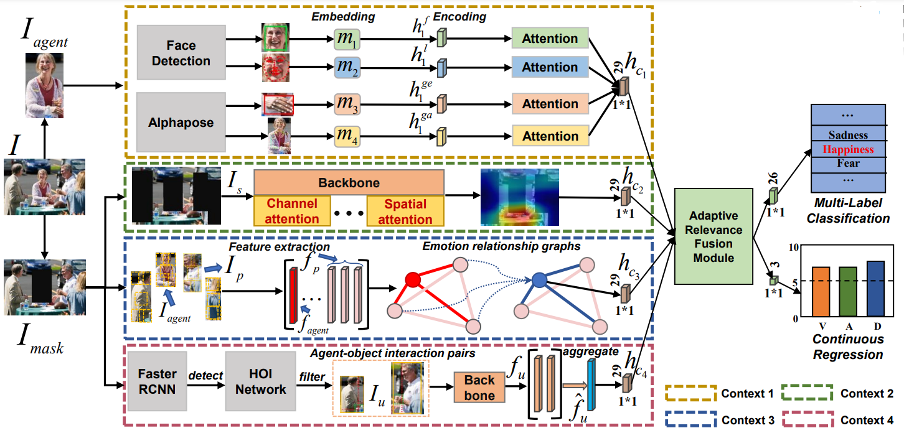

# Emotion Recognition for Multiple Context Awareness (ECCV 2022)
 

The proposed framework.

 

**We present a novel context-aware emotion recognition framework from a psychological and sociological perspective, which incorporates four context information.The first context is multimodal emotion recognition based on face, facial landmarks, gestures and gait. Secondly, we adopt the channel and spatial attention modules to obtain the emotion semantics of the scene context. Inspired by sociology theory, we explore the  emotion transmission between agents by constructing relationship graphs in the third context. Meanwhile, we propose a novel agent-object context, which aggregates emotion cues from the interactions between surrounding agents and objects in the scene to mitigate the ambiguity of prediction.Finally, we introduce an adaptive relevance fusion module for learning the shared representations among multiple contexts.**
